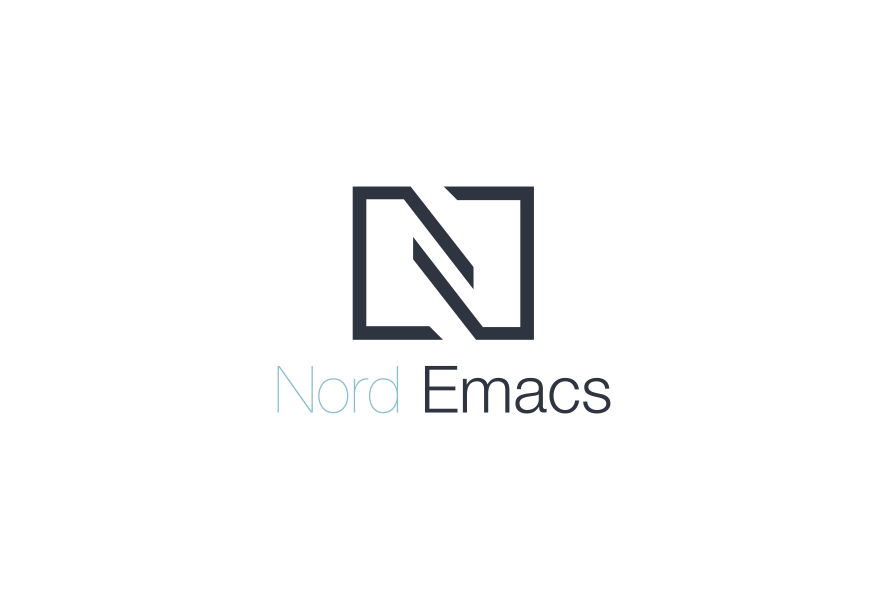
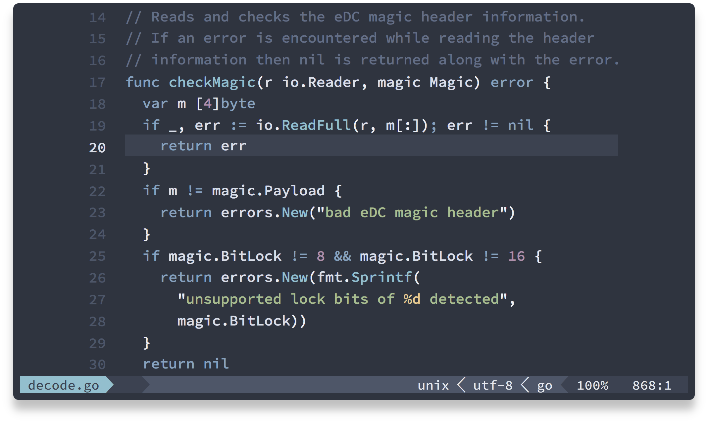
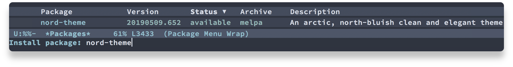
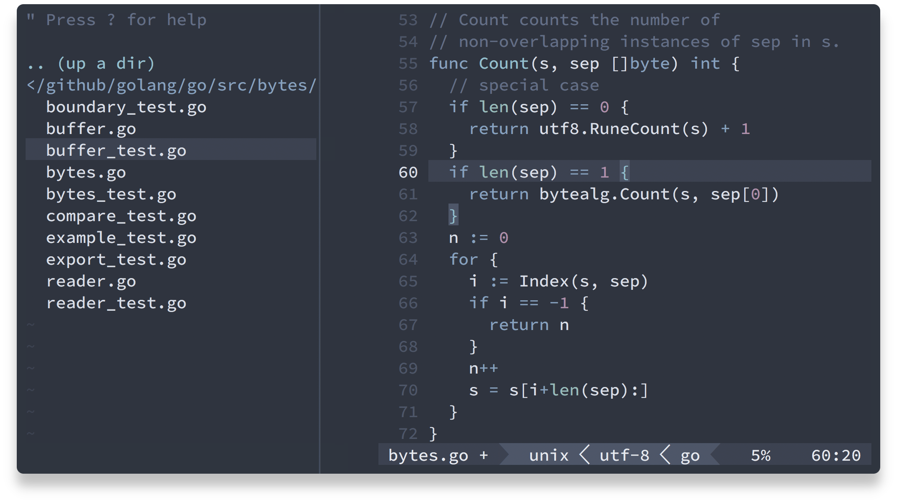
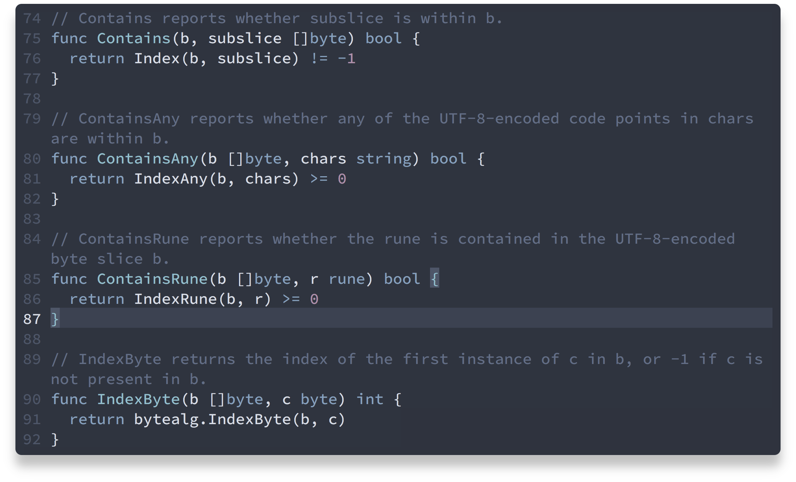
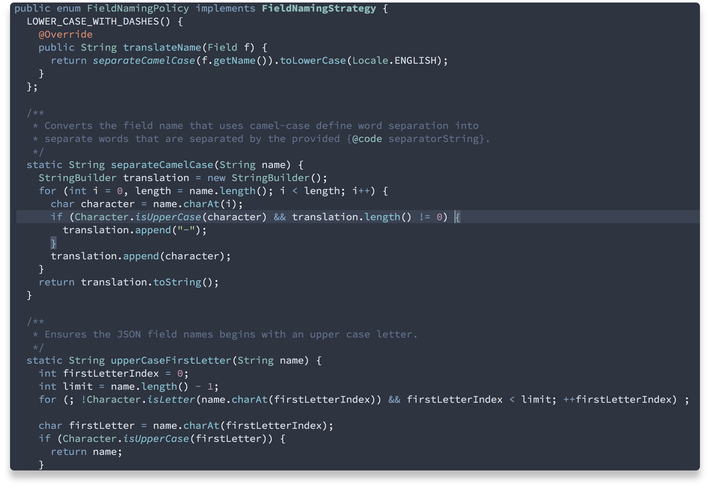
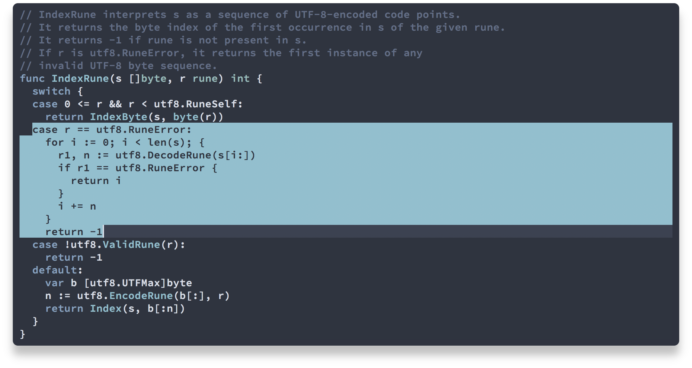

<p align="center"><a href="https://www.nordtheme.com/ports/emacs" target="_blank"></a></p>

<p align="center">An arctic, north-bluish clean and elegant <a href="https://www.gnu.org/software/emacs" target="_blank">Emacs</a> theme.</p>

<p align="center">Designed for a fluent and clear workflow based on the <a href="https://www.nordtheme.com">Nord</a> color palette.</p>

<p align="center"><a href="https://www.nordtheme.com/ports/emacs" target="_blank"></a></p>

Build for Emacs's terminal- and GUI mode with _true colors_ and support for many third-party syntax and UI packages.

## Getting Started

Visit the [official website][nord-home] to learn all about the [syntax highlighting][nord-home#syntax] features, details and elements of [UI and editor elements][nord-home#editor-details] and the [various theme configurations][nord-home#configurations].

Learn about the [installation and activation][nord-docs-home-install] and how to [configure][nord-docs-home-config] the theme from the [official documentations][nord-docs-home].

### Quick Start

Thanks to the builtin Emacs package manager, Nord Emacs can be installed for all platforms and the various variants/forks of Emacs in a uniform way with one command from [MELPA][] and [MELPA Stable][melpa-stable].

To install or update Nord Emacs

1. press <kbd>M-x</kbd>
2. run the `package-install` command
3. type `nord-theme` and confirm with <kbd>↲</kbd>

<p align="center"></p>

For more setup methods see the [official installation & activation guide][nord-docs-home-install] as well as Emacs [official package install documentations][emacs-docs-pack_inst] for more details about the builtin package management.

#### Activation

Make sure the [`~/.emacs.d/themes` directory][emacs-docs-custh] has been added to Emacs _load path_ by adding it to the list in your [init file][emacs-docs-initfile] (`.init.el`):

```lisp
(add-to-list 'custom-theme-load-path (expand-file-name "~/.emacs.d/themes/"))
```

To activate and use Nord Emacs as your default color theme load it in your init file:

```lisp
(load-theme 'nord t)
```

To switch to the theme on-the-fly

1. press <kbd>M-x</kbd>
2. run the `load-theme` command
3. type `nord` and confirm with <kbd>↲</kbd>

## Features

<p align="center"><strong>Your editor. Your style.</strong></p>
<p align="center">A unified UI and editor syntax element design provides a clutter-free and fluidly merging appearance.</p>
<p align="center"></p>

<p align="center"><strong>Small details with unobtrusive styles.</strong></p>
<p align="center">Small details with unobtrusive styles for popular and common code editor features like search result marker and brace matching — designed to get out of your way with a visually attractive appearance.</p>
<p align="center"></p>

<p align="center"><strong>Beautiful code to keep focused.</strong></p>
<p align="center">Support for a wide range of programming languages — from bundled languages up to many popular syntax third-party packages.</p>
<p align="center"></p>

<p align="center"><strong>Configure it to fit your needs.</strong></p>
<p align="center">Theme configurations like different <a href="https://www.nordtheme.com/docs/ports/emacs/configuration#region-highlight-style" target="_blank">region highlight styles</a> or <a href="https://www.nordtheme.com/docs/ports/emacs/configuration#uniform-mode-lines" target="_blank">uniform mode lines</a> allow to customize the theme to match your personal preferences.</p>
<p align="center"></p>

<p align="center"></p>

<p align="center">Copyright &copy; 2016-present <a href="https://github.com/arcticicestudio" target="_blank">Arctic Ice Studio</a> and <a href="https://github.com/svengreb" target="_blank">Sven Greb</a></p>

[emacs-docs-custh]: https://www.gnu.org/software/emacs/manual/html_node/emacs/Custom-Themes.html
[emacs-docs-initfile]: https://www.gnu.org/software/emacs/manual/html_node/emacs/Init-File.html
[emacs-docs-pack_inst]: https://www.gnu.org/software/emacs/manual/html_node/emacs/Package-Installation.html#Package-Installation
[melpa-stable]: https://stable.melpa.org
[melpa]: https://melpa.org
[nord-docs-home-config]: https://www.nordtheme.com/docs/ports/emacs/configuration
[nord-docs-home-install]: https://www.nordtheme.com/docs/ports/emacs/installation
[nord-docs-home]: https://www.nordtheme.com/docs/ports/emacs
[nord-home]: https://www.nordtheme.com/ports/emacs
[nord-home#configurations]: https://www.nordtheme.com/ports/emacs#configurations
[nord-home#editor-details]: https://www.nordtheme.com/ports/emacs#editor-details
[nord-home#syntax]: https://www.nordtheme.com/ports/emacs#syntax
